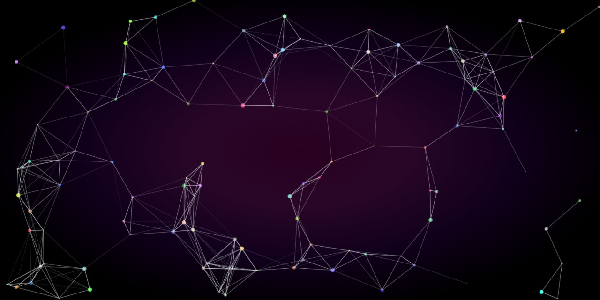
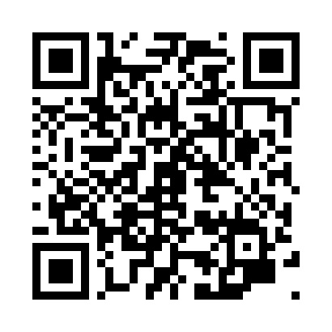

# LineAndParticlesAnimation

Dots connected by lines animation using vanilla javascript with canvas html.

## Sample:

This is an image of the final deployment... (i will improve this, cause it has a few bugs yet)

There is a link in the description section but i done a QR for you

                        

## Inspired in particles.js

Also credit to all the people who have done similar things like this.
